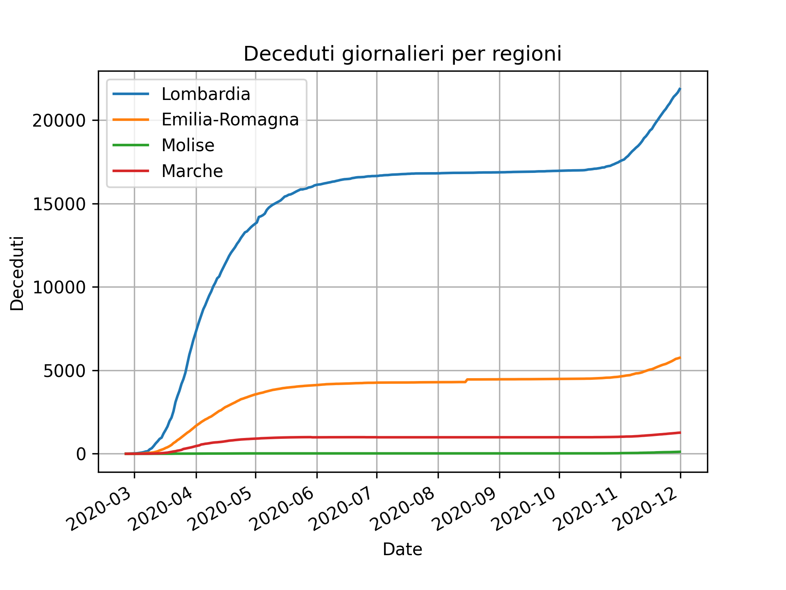
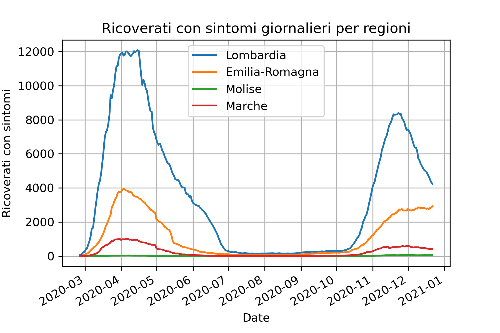

I grafici sotto riportati estraggono informazioni di rilievo a partire dagli [Open Data forniti dalla Presidenza del Consiglio dei Ministri](https://github.com/pcm-dpc/COVID-19). I grafici si aggiornano automaticamente allo scoccare della mezzanotte, con i dati del giorno precedente. I grafici possono anche essere scaricati in formato PNG da [qui](https://github.com/maldins46/CovidAnalysis/releases/latest).

# Parametri nazionali

Il grafico raffronta differenti indicatori a livello nazionale, in valori assoluti. 
- La linea blu riporta i deceduti per ogni giorno (in media mobile di 7 giorni, per mitigare la stagionalità settimanale); 
- La linea gialla riporta il numero di pazienti in terapia intensiva, per ogni giorno; 
- La linea verde riporta i nuovi positivi riportati ogni giorno (in media mobile di 7 giorni, per mitigare la stagionalità settimanale);
- La linea rossa riporta i ricoverati con sintomi, per ogni giorno.

Dal grafico si vede bene come il numero di nuovi positivi "traini" con ritardo medio di una settimana i ricoverati. Ciò permette di avere un'idea in anticipo dell'andamento della seconda. In linea di massima, al di fuori del periodo di picco, questo fenomeno non si verifica, a causa del minor numero di tamponi effettuati.

# Parametri regionali

I grafici seguenti raffrontano vari parametri a livello regionale, in particolare confrontando tre regioni prese come "benchmark", per rendere più chiaro il grafico: Lombardia, Emilia-Romagna, Marche. La scelta delle regioni è stata dettata anche dalla volontà di espandere l'analisi in particolare sulla regione Marche.

## Rt per regioni

Il grafico mostra l'andamento dell'indice Rt per le regioni del benchmark, calcolato con modellazione SIRD (un metodo semplificato, non quello utilizzato dall'ISS, ma indicativo). L'algoritmo segue il procedimento [indicato dall'INFN](https://covid19.infn.it/banner/Approfondimenti.pdf), con una modifica aggiuntiva che permette di considerare lo scostamento temporale tra nuovi infetti e guariti-deceduti. L'indice pone in relazione gli l'aumento degli infetti con quello dei deceduti e guariti, considerando uno scostamento temporale di 9 giorni tra infetti e deceduti-guariti (che denota il tempo medio di guarigione/morte per COVID-19). 

Per questo motivo, il metodo di calcolo porta l'indice ad essere "arretrato" di 9 giorni rispetto alla data odierna, pur essendo indicativo. In rosso e arancione sono riportate le soglie che portano, secondo l'ultimo DPCM, in zona arancione o rossa.

## Occupazione terapia intensiva per regioni

Il grafico riporta, per ogni regione del benchmark, la percentuale di occupazione dei reparti di terapia intensiva, calcolata come `n° posti occupati / n° posti disponibili`. Il numero di posti in terapia intensiva per regioni derivano da [una fonte esterna](https://www.infodata.ilsole24ore.com/2020/10/15/terapie-intensive-scopri-in-tempo-reale-quanti-posti-sono-occupati/). È riportata, con la traccia semi-trasparente, la media italiana. La linea gialla indica il livello d'allerta del 30% dei posti TI occupati (oltre il quale sono a rischio gli interventi ordinari), mentre la linea rossa la saturazione (100% di posti occupati).

## Tasso di positività

Il grafico indica, per ogni regione, la percentuale di tamponi positivi su quelli effettuati giornalmente (tampone molecolare). Avendo il dato una forte stagionalità settimanale, è stata effettuata una media mobile su 7 giorni, per ogni serie. È riportata, con la traccia semi-trasparente, la media italiana. In linea di massima, all'aumentare dei tamponi effettuati, la percentuale aumenta.  

## Nuovi positivi per regioni, per 100.000 abitanti

Il grafico indica i nuovi casi positivi registrati ogni giorno (ospedalizzati + isolamento domiciliare), per ogni regione del benchmark. Il dato è scalato sul 100.000 abitanti, rendendo così possibile mettere in relazione tra loro le regioni, tenendo conto della diversa densità di popolazione. Avendo il dato una forte stagionalità settimanale, è stata effettuata una media mobile su 7 giorni, per ogni serie. È riportata, con la traccia semi-trasparente, la media italiana.

## Deceduti per regioni, per 100.000 abitanti

Il grafico indica i deceduti per COVID-19 registrati ogni giorno, per ogni regione del benchmark. Il dato è scalato sul 100.000 abitanti, rendendo così possibile mettere in relazione tra loro le regioni, tenendo conto della diversa densità di popolazione. Avendo il dato una forte stagionalità settimanale, è stata effettuata una media mobile su 7 giorni, per ogni serie. È riportata, con la traccia semi-trasparente, la media italiana.

## Ricoverati con sintomi per regioni, per 100.000 abitanti

Il grafico riporta il numero di pazienti con sintomi COVID-19 ospedalizzati giornalmente. Il dato è scalato sul 100.000 abitanti, rendendo così possibile mettere in relazione tra loro le regioni, tenendo conto della diversa densità di popolazione. È riportata, con la traccia semi-trasparente, la media italiana.

# Parametri incentrati sulla regione Marche

Analisi più specifiche sono state portate avanti per quanto riguarda la regione Marche, in quanto interessato ad analizzare questa regione.

Il grafico raffronta differenti indicatori a livello regionale, in valori assoluti, con gli stessi valori indicati nel primo grafico, ma limitati ai valori regionali: 
- La linea blu riporta i deceduti per ogni giorno (in media mobile di 7 giorni, per mitigare la stagionalità settimanale); 
- La linea gialla riporta il numero di pazienti in terapia intensiva, per ogni giorno; 
- La linea verde riporta i nuovi positivi riportati ogni giorno (in media mobile di 7 giorni, per mitigare la stagionalità settimanale);
- La linea rossa riporta i ricoverati con sintomi, per ogni giorno.

## Nuovi positivi per provincia delle Marche, per 100.000 abitanti

Il grafico indica i nuovi casi positivi registrati ogni giorno (ospedalizzati + isolamento domiciliare), per ogni provincia della regione Marche. Il dato è scalato sul 100.000 abitanti, rendendo così possibile mettere in relazione tra loro le province, tenendo conto della diversa densità di popolazione. Esserndo il dato provinciale fortemente rumoroso, è stata effettuata una media mobile su un periodo di 28 giorni, per ogni serie. È riportata, con la traccia semi-trasparente, la media italiana.

## Nuovi positivi per provincia delle Marche, in valori assoluti

Il grafico indica i nuovi casi positivi registrati ogni giorno (ospedalizzati + isolamento domiciliare), per ogni provincia della regione Marche. Il dato è riportato in valosi assoluti, per evidenziare il numero effettivo di casi di ogni porvincia. Esserndo il dato provinciale fortemente rumoroso, è stata effettuata una media mobile su un periodo di 28 giorni, per ogni serie.
