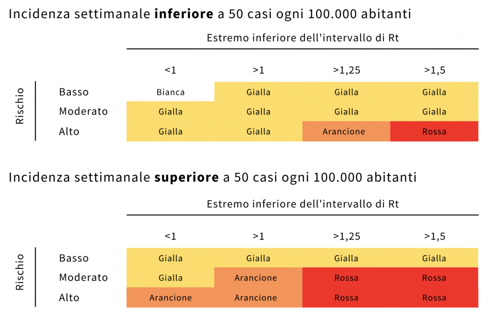

I grafici sotto riportati estraggono informazioni di rilievo a partire dagli [Open Data forniti dalla Protezione Civile](https://github.com/pcm-dpc/COVID-19). I grafici si rigenerano automaticamente allo scoccare della mezzanotte, con i dati aggiornati al giorno precedente. I grafici possono anche essere scaricati in formato PNG da [qui](https://github.com/maldins46/CovidAnalysis/releases/latest).

# Come vengono determinate le zone

A partire dal 16 di gennaio, i colori delle varie regioni vengono determinati sulla base di livello di rischio, valore dell'indice Rt e in base all'incidenza settimanale dei casi. Il meccanismo [viene spiegato molto bene da YouTrend](https://www.youtrend.it/2021/01/14/come-funziona-il-nuovo-sistema-per-decidere-i-colori-delle-regioni/). Riporto questo grafico dallo stesso articolo:

Il livello di rischio viene calcolato sulla base di molteplici parametri, tra cui la pressione sul sistema sanitario.

# Valori nazionali

## Parametri nazionali in val. assoluti

Il grafico raffronta differenti indicatori a livello nazionale, in valori assoluti. 
- La linea blu riporta i decessi giornalieri (in media mobile di 7 giorni); 
- La linea gialla riporta l'ammontare dei pazienti in terapia intensiva, per ogni giorno; 
- La linea verde riporta i nuovi positivi registrati ogni giorno (in media mobile di 7 giorni);
- La linea rossa riporta i'ammontare dei pazienti ricoverati con sintomi per COVID-19, per ogni giorno.

## Dosi di vaccino somministrate

Il grafico mostra le dosi di vaccino somministrate giornalmente, distinguendo somministrazioni per prima dose dalle somministrazioni per seconda dose. L'altezza complessiva di ogni barra indica il totale delle somministrazioni giornaliere.

# Valori regionali

I grafici seguenti raffrontano vari parametri a livello regionale, in particolare confrontando tre regioni prese come "benchmark", per rendere più chiaro il grafico: Veneto, Toscana, Marche. La scelta delle regioni è stata dettata anche dalla volontà di espandere l'analisi in particolare sulla regione Marche.

## Indice R(t) per regioni

Il grafico mostra l'andamento dell'indice R(t) per le regioni del benchmark, calcolato con **modellazione SIRD** (un metodo semplificato, **non quello utilizzato dall'ISS**, ma indicativo dell'andamento). Le soglie orizzontali indicano i vari **scenari**, a seconda dei quali vengono determinate le varie zone come riportato nella tabella a inizio pagina:
- **Scenario 1**: R(t) minore di 1;
- **Scenario 2**: R(t) compreso tra 1 e 1,25;
- **Scenario 3**: R(t) compreso tra 1.25 e 1.50;
- **Scenario 4**: R(t) superiori a 1.50.

L'algoritmo segue il procedimento [indicato dall'INFN](https://covid19.infn.it/banner/Approfondimenti.pdf), con alcune modifiche aggiuntive.

Nella pratica, la modellazione SIRD richiede che ogni punto del grafico venga calcolato come `α / (β + γ)`, in cui:
- `α`: incidenza settimanale dei nuovi casi;
- `β`: incidenza settimanale dei dimessi guariti;
- `γ`: incidenza settimanale dei deceduti per COVID-19.

A differenza del metodo dell'INFN, però, `β` e `γ` vengono "slittati" in avanti di 7 giorni (numero che denota la durata media di ricovero per COVID-19), permettendo di comparare tra loro le misure. È stata inoltre applicata una media mobile su 4 giorni per rendere la curva meno "spigolosa". Infine, un'ulteriore modifica è stata applicata al risultato precedente: ogni valore `x` maggiore di 2 viene posto essere uguale a `log2(x) + 1`. Ciò viene vatto per porre un "tetto" all'indice, che per la natura dei dati disponibili può assumere valori molto alti.

Tutti questi accorgimenti portano l'indice ad essere "arretrato" di 9 giorni rispetto alla data odierna. Questo è anche il motivo per cui in genere i vari metodi per il calcolo di R(t) non riportano il dato ad oggi, ma quello di almeno una settimana prima rispetto all'ultimo campione rilevato.

Orizzontalmente sono inoltre riportate le soglie che portano, al di sopra di esse, le regioni in zona arancione, rossa o gialla, secondo le regole valide dal 16 gennaio.

*Nota metodologica*: i differenti metodi per il calcolo di R(t) **possono portare a risultati molto differenti** tra di loro. In generale, **tutti i metodi modellano correttamente un valore maggiore di 1 nel caso in cui i contagi sono in aumento, e minore di 1 nel caso in cui siano in diminuzione, ma lo scostamento dal valore 1 può variare tra i metodi anche di molto**. 

**EpiEstim**, il modello utilizzato dall'ISS, è molto più preciso: utilizza un modello probabilistico complesso e tiene traccia tra le altre anche dei casi importati (dato non disponibile da quelli forniti dalla Protezione Civile). In generale tale modello e porta a valori più bassi nel momento il cui il valore è maggiore di 1 (compresi tra 1 e 2,5). Il modello SIRD, al contrario, quando superiore a 1, può portare a valori anche di molto alti, in quanto vengono fatte varie assunzioni anche molto forti (motivo per cui è stata posta la funzione "tetto"). Basti pensare ad `α`: l'incidenza settimanale dei nuovi casi dovrebbe considerare tutte le persone infette dal preciso momento di inizio dell'infezione, compresi gli asintomatici: dato che non è possibile da ottenere, e che porta quindi la stima a essere approssimata.

## Dosi di vaccino somministrate per 100.000 abitanti

Il grafico mostra le singole dosi di vaccino somministrate giornalmente per ogni regione. Il dato è scalato su 100.000 abitanti, rendendo così possibile mettere in relazione tra loro le regioni, tenendo conto della diversa densità di popolazione. È riportata, con la traccia semi-trasparente, la media italiana.

## Percentuale popolazione immunizzata

Il grafico mostra la percentuale di popolazione, per ogni regione del benchmark e per l'Italia (traccia semi-trasparente) che puo essere definita immunizzata, ovvero tale da aver ricevuto sia la prima dose che il richiamo.

## Incidenza settimanale casi, per 100.000 abitanti

Il grafico mostra l'incidenza settimanale dei nuovi casi registrati, per ogni regione, scalato su 100.000 abitanti. In altre parole, ogni punto del grafico esprime **la differenza tra il totale dei casi registrati nel giorno *n* rispetto al giorno *n - 7***. Il dato viene riportato in quanto la soglia a 50 è uno dei nuovi parametri previsti dalle regole valide dal 16 gennaio, come indicato nella tabella iniziale.

## Nuovi positivi per regioni, per 100.000 abitanti

Il grafico indica i nuovi casi positivi registrati ogni giorno, tramite tampone molecolare, per ogni regione del benchmark. Il dato è scalato su 100.000 abitanti, rendendo così possibile mettere in relazione tra loro le regioni, tenendo conto della diversa densità di popolazione. Avendo il dato una forte stagionalità settimanale, è stata effettuata una media mobile su 7 giorni, per ogni serie. È riportata, con la traccia semi-trasparente, la media italiana.

## Occupazione terapia intensiva per regioni

Il grafico riporta, per ogni regione del benchmark, la percentuale di occupazione dei reparti di terapia intensiva, calcolata come `n° posti occupati / n° posti disponibili`. Il numero di posti in terapia intensiva per regioni derivano da [una fonte esterna](https://www.infodata.ilsole24ore.com/2020/10/15/terapie-intensive-scopri-in-tempo-reale-quanti-posti-sono-occupati/). È riportata, con la traccia semi-trasparente, la media italiana. La linea gialla indica il livello d'allerta del 30% dei posti TI occupati (oltre il quale sono a rischio gli interventi ordinari), mentre la linea rossa la saturazione (100% di posti occupati).

## Tasso di positività

Il grafico indica, per ogni regione, la percentuale di tamponi positivi su quelli effettuati giornalmente (tampone molecolare). Avendo il dato una forte stagionalità settimanale, è stata effettuata una media mobile su 7 giorni, per ogni serie. È riportata, con la traccia semi-trasparente, la media italiana. In linea di massima, all'aumentare dei tamponi effettuati, la percentuale aumenta.  

# Valori incentrati sulla regione Marche

Analisi più specifiche sono state portate avanti per quanto riguarda la regione Marche, in quanto interessato ad analizzare questa regione.

## Parametri Marche in val. assoluti

Il grafico precedente raffronta differenti indicatori a livello regionale, in valori assoluti, con gli stessi valori indicati nel primo grafico, ma limitati ai valori regionali: 
- La linea blu riporta i decessi giornalieri (in media mobile di 7 giorni); 
- La linea gialla riporta l'ammontare dei pazienti in terapia intensiva, per ogni giorno; 
- La linea verde riporta i nuovi positivi registrati ogni giorno (in media mobile di 7 giorni);
- La linea rossa riporta i'ammontare dei pazienti ricoverati con sintomi per COVID-19, per ogni giorno.

## Dosi di vaccino somministrate nelle Marche

Il grafico mostra le dosi di vaccino somministrate giornalmente nelle Marche, distinguendo somministrazioni per prima dose dalle somministrazioni per seconda dose. L'altezza complessiva di ogni barra indica il totale delle somministrazioni giornaliere.

## Nuovi positivi per provincia delle Marche, per 100.000 abitanti

Il grafico indica i nuovi casi positivi registrati ogni giorno, tramite tampone molecolare, per ogni provincia della regione Marche. Il dato è scalato sul 100.000 abitanti, rendendo così possibile mettere in relazione tra loro le province, tenendo conto della diversa densità di popolazione. Il dato provinciale è fortemente instabile: per la consultazione, è stata effettuata una media mobile su un periodo di 14 giorni, il che porta ad avere il dato arretrato temporalmente di una settimana. È riportata, con la traccia semi-trasparente, la media italiana.

## Nuovi positivi per provincia delle Marche, in valori assoluti

Il grafico indica i nuovi casi positivi registrati ogni giorno, tramite tampone molecolare, per ogni provincia della regione Marche. Il dato è riportato in valosi assoluti, per evidenziare il numero effettivo di casi di ogni porvincia. Il dato provinciale è fortemente instabile: per la consultazione, è stata effettuata una media mobile su un periodo di 14 giorni, il che porta ad avere il dato arretrato temporalmente di una settimana. È riportata, con la traccia semi-trasparente, la media italiana.
